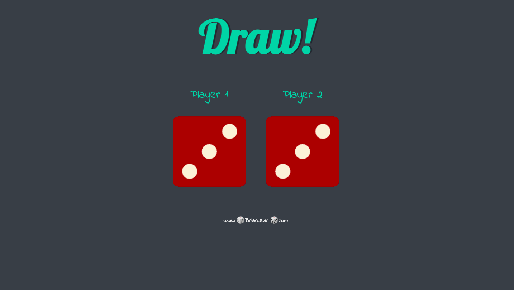

# Dicee-Game

## Application description:
A simple Javascript game application that allows the user to refresh the page. With each page refresh, the outcome of each page will be randomly determined if player 1 won, player 2 won or if there is a draw.
 

 ## Click [here](https://brianlevin.github.io/Dicee-Game/) for the live app. 
 
 This is  the page displayed when player 1  wins:
 
 
 
 This  page is displayed when player 2 wins:
 

  
  
 This page is displayed when there is a draw:
 
  

     
## Libraries and Frameworks:

- HTML
- CSS
- Javascript

## Email:

bml201095@gmail.com
